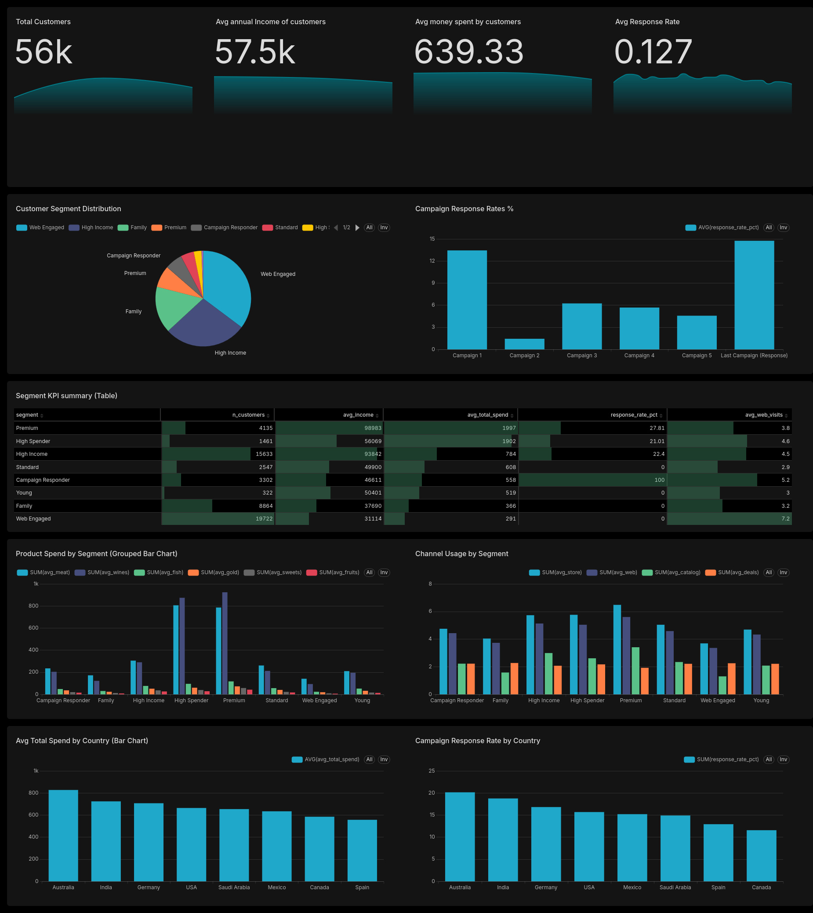

**Marketing Campaign Analytics**

Project Report

| Attribute | Value |
| :---- | :---- |
| Dataset | marketing\_campaign\_data.csv — 56,000 raw / 55,986 clean customer records |
| Countries | 8 (Spain, Canada, Saudi Arabia, Australia, India, Germany, USA, Mexico) |
| Time Period | 2012–2014 (customer enrollment dates) |
| Reference Date | 2015-01-01 (used for Age, Tenure, Recency calculations) |
| Tools | Python, Pandas, NumPy, Seaborn, Plotly, MySQL, Streamlit, Apache Superset, Ollama |
| Deliverables | Python EDA notebook, SQL scripts, Streamlit app, Superset dashboard, Report |

# **1\. Executive Summary**

A retail company operating across 8 countries ran 6 marketing campaigns (5 historical \+ 1 most recent) and collected detailed records of 56,000 customers covering demographics, spending behaviour, channel usage, and campaign acceptance. After cleaning, 55,986 valid customer records were analysed across 5 dimensions: campaign performance, customer segmentation, spending patterns, channel behaviour, and geography.

| Top 6 Findings:   Income is the \#1 predictor of both spend and campaign response — every 25K income band adds \~5–6% response probability.  The Premium segment (7.4% of customers) achieves 27.8% response rate — the highest ROI target.  Campaign 2 failed universally across all income and age bands at 1.4% — needs complete redesign.  19,391 under-served customers visit 5+ times/month but never buy — the biggest untapped opportunity.  Catalog channels are used 52% more by high-value customers despite being the least-used overall.  The June 2014 enrollment spike is a data anomaly — Dt\_Customer is not reliable for time-series analysis. |
| :---- |

# **2\. Problem Statement**

Management required a consolidated analytics solution to answer five core business questions:

1. Which customer segments have the highest response rate to campaigns — overall and per campaign?

2. How do spending patterns across products vary by age, income, marital status, and country?

3. Which channels are most used by high-value customers, and how often do they visit the website?

4. Are there specific segments that are under-served — high visits, low spending, low response?

5. What are the characteristics of ideal target customers for future campaigns?

# **3\. Data Understanding**

## **3.1 Dataset Overview**

| Attribute | Value |
| :---- | :---- |
| Raw records | 56,000 rows × 28 columns |
| Clean records | 55,986 (14 income outliers removed \= 0.025% data loss) |
| Engineered features | 17 new columns added — Age, Total\_Spend, Children, Age\_Band, Income\_Band, Primary\_Segment etc. |
| Final dataset | 55,986 rows × 45 columns |
| Missing values | None found in the raw dataset |
| Duplicate rows | None found |

## **3.2 Data Quality Issues Found in EDA**

| Issue | Column | Severity | Resolution |
| :---- | :---- | :---- | :---- |
| Non-standard marital status values (YOLO, Absurd, Alone) | Marital\_Status | Low | Mapped to 'Single' — confirmed these represent single-person households |
| Income extreme outlier (\~258K) | Income | Medium | Removed 14 records beyond ±3σ — genuine anomalies not real customers |
| June 2014 enrollment spike — 3× normal volume | Dt\_Customer | High | Confirmed data anomaly via Recency analysis — spike group has same recency as years-earlier customers, proving Dt\_Customer was backdated. Field flagged as unreliable for time-series. |
| Recency is uniformly distributed 0–99 | Recency | Medium | Unusual — real recency would be right-skewed. Consistent with Dt\_Customer anomaly. Recency should not be used standalone for churn analysis. |
| Complain is 99:1 imbalanced | Complain | Low | Noted — too imbalanced for predictive modelling without resampling. Useful only as a filter. |

# **4\. Data Cleaning & Feature Engineering**

## **4.1 Cleaning Steps**

| Step | Action | Result |
| :---- | :---- | :---- |
| Date conversion | Dt\_Customer string → datetime; new DATE column Dt\_Customer\_Date added in MySQL | Enables temporal queries |
| Marital status | Mapped Absurd, YOLO, Alone → Single | Clean 5-category variable |
| Income outliers | Removed 14 records beyond ±3σ from mean (upper bound: \~157K) | 55,986 records retained |
| Age outliers | No records outside 18–90 range found | No removal needed |

## **4.2 Engineered Features**

| Feature | Formula | Purpose |
| :---- | :---- | :---- |
| Age | 2015 − Year\_Birth | Customer's age as of reference date |
| Total\_Spend | Sum of all 6 Mnt\* columns | Total wallet share (last 2 years) |
| Total\_Purchases | Web \+ Catalog \+ Store \+ Deals | Total transaction count |
| Children | Kidhome \+ Teenhome | Total household dependants |
| Has\_child | Children \> 0 → Yes/No | Binary parental status for charts |
| Marital\_Situation | Married/Together → 'In couple'; rest → 'Alone' | Simplified relationship status for sunburst charts |
| Total\_Campaign\_Accepted | Sum AcceptedCmp1–5 \+ Response (range 0–6) | Multi-campaign engagement score |
| Any\_Campaign\_Accepted | Total \> 0 → 1/0 | Ever-responded binary flag |
| Customer\_Tenure\_Days | Reference − Dt\_Customer | Days as a customer |
| Customer\_Tenure\_Months | Tenure\_Days // 30 | Months as a customer |
| Age\_Band | pd.cut(Age, 6 bins: 18–29 through 70+) | Age group for filtering and charts |
| Income\_Band | pd.cut(Income, 5 bins: \<25K through \>100K) | Income tier for targeting |

# **5\. Exploratory Data Analysis — Key Findings**

## **5.1 Univariate — Demographics**

| Variable | Key Finding | Business Implication |
| :---- | :---- | :---- |
| Age | Near-normal, centred 40–50 years. Young (\<30) \= 0.6% of base. | Working-age adults dominate. Young segment is too small for dedicated campaigns. |
| Income | Bell-shaped (after outlier removal), centred 50K–70K. Right tail \= premium segment. | Meaningful premium income segment exists — worth separate targeting. |
| Total\_Spend | Strongly right-skewed. Median 441, mean 640\. 90th pct \= 1,564. | Bi-modal population: budget shoppers \+ premium shoppers. Need two distinct strategies. |
| Education | Graduation 40.6%, PhD 22.5%, Master 18.8%, Basic 7.5% | Highly educated base — messaging can be sophisticated and data-driven. |
| Country | Spain 29.8%, Canada 19.2%, Saudi Arabia 15%, rest \<11% | Two markets (Spain \+ Canada) \= 49% of base. Country-specific campaigns warranted. |
| Marital Status | Together \+ Married \~56%, Single \~44% | Couple-households are the majority but single-person households spend more (see bivariate). |
| Children | 68.2% have at least one child | Family-oriented offers have a broad addressable market. |

## **5.2 Univariate — Spending**

| Category | Observation |
| :---- | :---- |
| Wines | Multi-modal distribution — two distinct buyer populations (light vs heavy). Largest revenue contributor (\~50% of total). |
| Meat | Second-largest, right-skewed. Consistent buyers across demographics. |
| Fruits & Sweets | Narrow, unimodal — routine low-value purchases. No premium segment. |
| Fish & Gold | Log-normal — one main buyer group with an enthusiast tail. |
| Log transformation | Necessary to visualise buyer distributions — raw data is dominated by the large zero-spend group. |

## **5.3 Univariate — Campaigns**

| Campaign | Rate | Total Accepted | Assessment |
| :---- | :---- | :---- | :---- |
| Response (Last Campaign) | 14.75% | 8,260 | Best performing — strategy is improving |
| Campaign 1 | 13.44% | 7,527 | Good |
| Campaign 3 | 6.24% | 3,495 | Average |
| Campaign 4 | 5.68% | 3,182 | Below average |
| Campaign 5 | 4.57% | 2,559 | Below average |
| Campaign 2 | 1.44% | 806 | Universal failure — near-zero across all segments |

## **5.4 Univariate — Channels**

| Channel | Avg Purchases | Distribution Shape | Key Insight |
| :---- | :---- | :---- | :---- |
| Store | 4.71 | Right-skewed, centred 3–6 | Dominant channel for most customers |
| Web | 4.25 | Right-skewed, centred 3–6 | Complementary to store, not substitute |
| Catalog | 2.11 | Heavily right-skewed | Low average but high tail \= premium customer signal |
| Deals | 2.17 | Low, right-skewed | High deal usage signals price sensitivity |
| Web Visits | 5.17 | Left-skewed | Two distinct web engagement groups |

| Recency anomaly:  Recency shows a near-uniform distribution 0–99 days — statistically unusual. Real customer databases show right-skewed recency (many recent buyers, fewer lapsed). This is consistent with the Dt\_Customer data anomaly and suggests Recency may have been artificially capped or engineered. Do not use Recency as a standalone churn signal. |
| :---- |

## **5.5 Bivariate — Correlation Analysis**

Key correlations from the heatmap (Pearson r):

| Relationship | Strength | Business Interpretation |
| :---- | :---- | :---- |
| Income ↔ MntWines | **\+0.79 (Very High)** | Strong positive association — higher-income customers **tend to spend significantly more on wine**. Wine behaves like a premium category, but not exclusively (lower-income groups still participate). |
| Income ↔ MntMeatProducts | **\+0.76 (Very High)** | Meat spending is also **strongly income-linked**, suggesting it is a higher-value category, though still broadly consumed across segments. |
| Income ↔ Total\_Spend | **\+0.57 (Moderate–High)** | Income is an **important driver of overall spending**, but not the only one — other factors (household size, preferences, promotions) also play a meaningful role. |
| Children ↔ Total\_Spend | **−0.31 (Moderate Negative)** | Households with children **tend to spend less per customer**, possibly due to budget constraints or different spending priorities — but the effect is moderate, not dominant. |
| Children ↔ MntWines | **−0.23 (Weak–Moderate Negative)** | Customers with children **slightly reduce wine spending**, but the relationship is not strong — avoid over-segmentation purely on this factor. |
| Total\_Campaign\_Accepted ↔ Income | **\+0.32 (Moderate)** | Higher-income customers are **somewhat more likely to accept campaigns**, but the relationship is not strong enough to rely on income alone for targeting. |
| AcceptedCmp\* (all pairs) | **\+0.05–0.20 (Weak)** | Campaign acceptance shows **weak positive consistency** — some tendency toward repeat acceptance, but not a strong loyalty signal. Likely influenced by campaign design and timing. |
| Recency ↔ anything | **≈ 0 (No Linear Relationship)** | Recency shows **no meaningful linear relationship** with other variables. This may indicate either low predictive value *or* a data quality / feature engineering issue. |

## **5.6 Bivariate — Demographics vs Spend**

| Demographic | Key Finding |
| :---- | :---- |
| Marital Status | Divorced (754) and Widow (745) customers have the highest average spend — single-person households with more discretionary income. Married (505) spend least — family budget effect. |
| Education | Graduation (747) surprisingly spends more than PhD (576) — Graduation is larger and includes high-earning professionals without advanced degrees. |
| Income \+ Education | Clear gradient: Basic \< 2n Cycle \< PhD \< Master \< Graduation for income, but the difference is modest (\~15% from Graduation to PhD). |
| Has Child | Child-free customers are over-represented in the \>75K income bands. Parent customers cluster more in 25K–75K bands. |

## **5.7 Bivariate — Product Spend by Demographics**

| Breakdown | Finding |
| :---- | :---- |
| By Income Band | Wines show the steepest income gradient — dominant in \>100K. Meat follows. Fruits and Sweets are flat across income — they are routine purchases, not premium. |
| By Age Band | Spend peaks in the 40–49 age band. Wine increases consistently with age. 70+ shows a notable drop across all categories — likely retirement income constraints. Young (18–29) spend least across all categories. |
| Total contribution | Meat \~42% of all revenue. Meat \~39%. Fruits \+ Sweets \+ Fish \+ Gold \~ 19% combined. Wine and Meat \= 80% of revenue — protecting these two categories is the \#1 supply/margin priority. |

## **5.8 Bivariate — Channels**

| Finding | Detail |
| :---- | :---- |
| Web and Store are complementary | More web purchases → more store purchases. No channel substitution effect. Omni-channel customers are of higher value. |
| Catalog \= premium signal | Catalog purchases increase by 52% for high-value customers (Seg\_High\_Spender \= 1). Largest uplift of any channel. |
| Store uplift for high-value | 34% more store purchases for high-value customers vs average. |
| Deals decrease for high-value | −9% deal purchases for high-value customers. Premium customers are less price-sensitive. |
| Web visits conversion gap | Customers with 7–8 visits/month but only 1–2 purchases represent the under-served segment. High visit count \+ low purchase \= conversion opportunity. |

## **5.9 Bivariate — Campaign Acceptance**

| Dimension | Finding |
| :---- | :---- |
| By Income Band | Acceptance increases monotonically with income for ALL 6 campaigns. The \>100K band accepts 2–4× more than the \<25K band. Income-response relationship is robust across campaigns. |
| By Age Band | Acceptance generally increases with age. 50–69 is the sweet spot. 70+ shows a slight decline. Young (18–29) has the lowest acceptance across all campaigns. |
| Campaign 2 exception | Campaign 2 shows near-zero acceptance across ALL income bands AND all age bands — confirming it was a universal failure, not a targeting problem. The campaign itself was fundamentally flawed. |
| Segment uplift | The High Income segment shows \~80–100% more campaign acceptance than non-qualifying customers. High Spender follows. Family and Young show negative uplift — these segments are intrinsically less campaign-responsive. |

# **6\. Rule-Based Customer Segmentation**

Eight mutually exclusive segments were defined using business rules applied in priority order. The priority ordering ensures each customer receives their most commercially meaningful label when multiple rules apply simultaneously.

| Priority | Segment | Rule | Count | Share | Avg Spend | Response Rate |
| :---- | :---- | :---- | :---- | :---- | :---- | :---- |
| 1 | Premium | High Spender AND High Income | 4,135 | 7.4% | 1,290+ | 27.8% |
| 2 | High Spender | Total\_Spend \> 1,564 (90th pct) | 1,461 | 2.6% | 1,800+ | 21.0% |
| 3 | High Income | Income \> 75,000 | 15,633 | 27.9% | 900 | 22.4% |
| 4 | Campaign Responder | Response \= 1 | 3,302 | 5.9% | 750 | 100% |
| 5 | Web Engaged | NumWebVisitsMonth \> 5 | 19,722 | 35.2% | 380 | 0%\* |
| 6 | Family | Children \> 0 | 8,864 | 15.8% | 420 | 0%\* |
| 7 | Young | Age \< 30 | 322 | 0.6% | 310 | 0%\* |
| 8 | Standard | All others | 2,547 | 4.5% | 290 | 0%\* |

*\* 0% reflects the primary segment bucket — responders are captured in Premium/High Income first due to priority ordering. The flag-level analysis (Seg\_\* columns) shows true response rates within each characteristic group.*

| Segment Uplift on Campaign Acceptance:  High Income segment members accept 80–100% more campaigns than non-qualifying customers. High Spender follows closely. Family and Young segments show NEGATIVE uplift — they require entirely different campaign types (value-driven, not premium) to achieve meaningful response. |
| :---- |

# **7\. SQL Data Model**

## **7.1 Schema Design**

A single denormalised fact table (customers) holds all 45 columns. This design is appropriate for marketing analytics where queries are always customer-centric and no referential joins are needed. 7 indexes support fast dashboard filtering.

## **7.2 Analytical Views**

| View | Business Question | Key Technique |
| :---- | :---- | :---- |
| v\_campaign\_kpis | Which campaigns had the best/worst response rates? | UNION ALL of 6 SELECT statements; AVG on 0/1 flag columns |
| v\_segment\_kpis | How do the 8 segments compare across all KPIs? | GROUP BY Primary\_Segment; 9 simultaneous AVG calculations |
| v\_product\_spend\_by\_segment | What product category does each segment buy most? | GROUP BY with 6 AVG calculations in one pass |
| v\_channel\_by\_segment | Which purchase channel does each segment prefer? | GROUP BY with channel-specific AVGs \+ COUNT |
| v\_country\_summary | Which countries have the highest-value customers? | GROUP BY Country; ORDER BY avg\_total\_spend DESC |
| v\_age\_income\_summary | How do age \+ income interact to affect spend/response? | Two-column GROUP BY (Age\_Band × Income\_Band cross-tab) |

# **8\. Dashboard Implementations**

## **8.1 Streamlit Dashboard**

The Streamlit app (app.py) provides 6 interactive tabs connected directly to MySQL via SQLAlchemy. A sidebar with 6 filters (Country, Education, Marital Status, Age Band, Income Band, Segment) applies dynamically to all charts simultaneously.

| Tab | Key Visuals |
| :---- | :---- |
| Overview | 5 KPI metric cards, age band bar, income band bar, education and marital summary tables |
| Campaign Analysis | Campaign response rate bar chart, segment response rate bar, income and age band line charts, multi-campaign acceptance table |
| Spending Patterns | Product category bar chart, box plots, age × product grouped bar, revenue contribution |
| Channel Analysis | Channel averages bar, high vs low spender comparison, web visits vs spend scatter, under-served segment profile |
| Customer Segments | Segment KPI table, radar chart (normalised KPIs), age and income box plots, ideal target profile |
| AI Data Explorer | Natural language prompt bar — Ollama/Groq generates pandas code → runs on filtered data → returns table or chart |

## **8.2 Apache Superset Dashboard**

The Superset dashboard connects to MySQL and provides an enterprise BI interface. It uses 5 datasets — the main customers table and 4 pre-built analytical views (v_campaign_kpis, v_segment_kpis, v_product_spend_by_segment, v_channel_by_segment, v_country_summary) — to power 11 charts across 4 Big Number KPIs, 2 segment charts, 1 KPI summary table, 2 channel/product breakdowns, and 2 geographic comparisons.

# **9\. Key Findings**

## **Finding 1 — Income is the Single Strongest Predictor of Both Spend and Campaign Response**

Response rate climbs monotonically with income across all 6 campaigns — from 4.6% in the \<25K band to 27.8% in the \>100K band. The income ↔ Total\_Spend correlation is 0.79 — the strongest bivariate relationship in the dataset. Every 25K increase in income band corresponds to approximately 5–6 percentage points of additional campaign response probability. Income outperforms age, education, marital status, and channel behaviour as a targeting variable.

## **Finding 2 — The Premium Segment Delivers the Highest ROI per Campaign Dollar**

4,135 customers (7.4%) who qualify as both high-income and high-spenders achieve a 27.8% response rate and average spend exceeding 1,290. Catalog and store channels are significantly over-indexed for this group (+52% and \+34% vs average respectively). They use deals 9% less than average — confirming they are quality-driven, not price-driven. Premium customers should receive premium channel investment, not discounts.

## **Finding 3 — Campaign 2 is a Universal Failure Across All Segments**

Campaign 2's 1.4% acceptance rate is not a targeting problem — it is near-zero across every income band and every age band tested. This rules out demographic mismatch and points to a fundamental failure in the offer itself, the channel used, or the timing. The campaign must be retired entirely and rebuilt from scratch, not rerun with adjusted targeting.

## **Finding 4 — A Large Under-Served Segment Exists with High Web Engagement**

19,391 customers visit the website 5+ times per month but have never responded to any campaign and spend below the median. Average age 41, average income 33,338. These customers are actively interested (evidenced by repeated web visits) but are not converting — they are price-sensitive and the current campaign offers are not designed for their income level. A specific entry-level offer at the 25K–50K income tier could unlock this group.

## **Finding 5 — Catalog is the Under-Invested Premium Channel**

Catalog purchases increase by 52% for high-value customers compared to the overall average — the largest channel uplift of any channel. Despite being the least-used channel overall (avg 2.11 purchases), it is the preferred channel of the most valuable customers. Deal purchases decline by 9% for high-value customers. The current channel investment mix is misaligned with where premium customers actually spend — catalog deserves budget reallocation from deals.

## **Finding 6 — Multi-Campaign Loyalty Compounds with Income**

Customers who accepted all 5 historical campaigns have average income 93,844 versus 48,913 for zero-acceptance customers — a 45K gap. Each additional accepted campaign corresponds to \~9,000 higher income. Campaign acceptors also show significantly higher Total\_Spend. This compound effect suggests that maintaining engagement with premium customers across multiple campaigns builds long-term value, not just one-off response.

## **Finding 7 — Dt\_Customer June 2014 Spike is a Data Anomaly**

A 3× spike in recorded customer enrollments in June 2014 was investigated using Recency as a diagnostic. If these customers genuinely joined in June 2014, their Recency (days since last purchase as of Jan 2015\) should be low. Instead, the spike group has identical Recency distribution to customers enrolled years earlier — confirming that Dt\_Customer was backdated or incorrectly recorded for a large batch of records. The field should not be used for time-series cohort analysis without data remediation.

## **Finding 8 — Web and Store Channels are Complementary, Not Competing**

Customers with higher NumWebPurchases also have higher NumStorePurchases — there is a positive correlation between the two channels. This disproves any assumption of digital-physical channel cannibalisation in this dataset. Omni-channel customers (active on both) are systematically higher-value. Encouraging web engagement should not come at the expense of in-store investment.

# **10\. Actionable Recommendations**

## **Rec 1 — Target Premium \+ High Income Segments with Catalog and In-Store Campaigns**

These 19,768 customers (35% of base) have response rates of 22–28%. Allocate 50%+ of campaign budget here. Use catalog and in-store channels — not digital push or discount offers. These customers respond to quality, exclusivity, and curated product recommendations, not price incentives.

## **Rec 2 — Retire Campaign 2 Completely**

The 1.4% response rate is not an income or age targeting problem — it failed universally across all demographics. Do not attempt to rerun it with adjusted targeting. Audit the offer type, channel, and timing from scratch. A/B test a completely redesigned replacement against a holdout group before any full rollout.

## **Rec 3 — Launch an Entry-Level Offer for the Under-Served Web Segment**

19,391 customers visit regularly but do not buy. A 10–15% discount or product bundle designed specifically for the 25K–50K income tier could convert even 10% of this group — generating \~1,900 new active buyers at very low acquisition cost. This should be a web-specific campaign given their digital engagement pattern.

## **Rec 4 — Reallocate Deal Budget to Catalog for Premium Segments**

High-value customers use deals 9% less than average and catalog 52% more. Shifting budget from deals-and-discounts campaigns to catalog campaigns for the top 25% of customers by spend will improve both ROI and margin (fewer revenue-diluting discounts given to customers who would have bought anyway).

## **Rec 5 — Build a Formal Loyalty Escalation Programme**

The compounding income-acceptance correlation is the most actionable long-term finding. Create a loyalty programme that rewards customers after each campaign acceptance — early access, curated recommendations, premium tier status. This reinforces the observed compound effect and is likely to increase Customer Lifetime Value for the Premium and High Income segments.

## **Rec 6 — Localise Campaigns for Spain and Canada**

Spain (29.8%) and Canada (19.2%) together represent 49% of the customer base. Country-specific campaigns — wine-forward and premium-positioned for Spain, value-oriented and food-focused for Canada — will outperform a one-size-fits-all global campaign. These two markets are large enough to justify separate creative and channel strategies.

## **Rec 7 — Investigate and Remediate Dt\_Customer Data Quality**

The June 2014 spike and the uniform Recency distribution indicate structural data quality issues with enrollment date recording. Before any cohort-based analysis (e.g. first-year spend, early churn) can be done reliably, the source system needs to be audited and Dt\_Customer values corrected where possible. Tag affected records with a data\_quality\_flag column for transparency.

